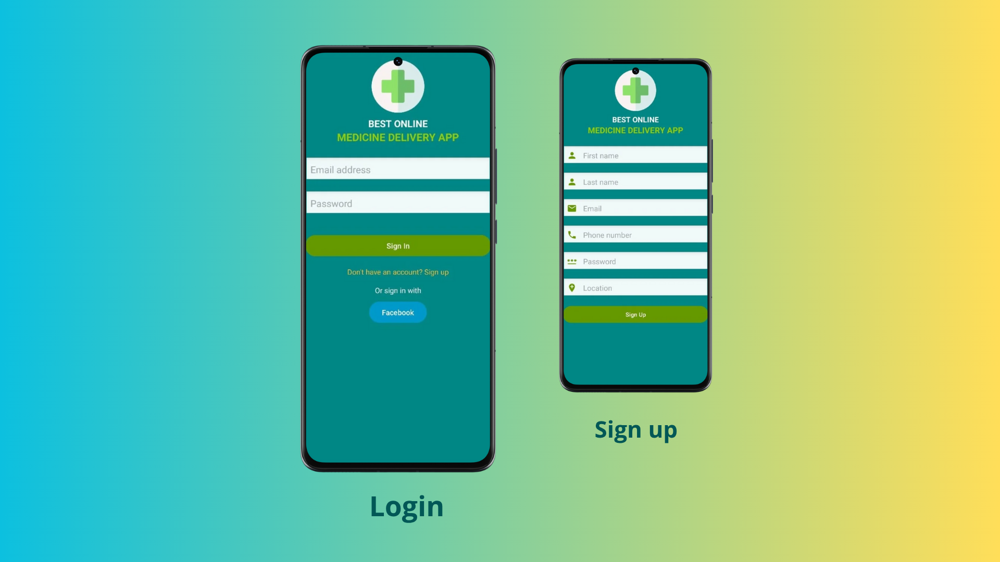
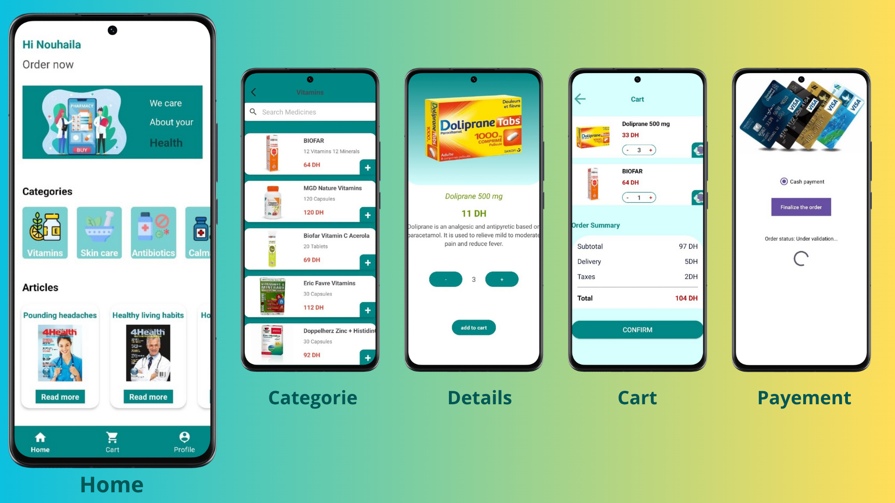
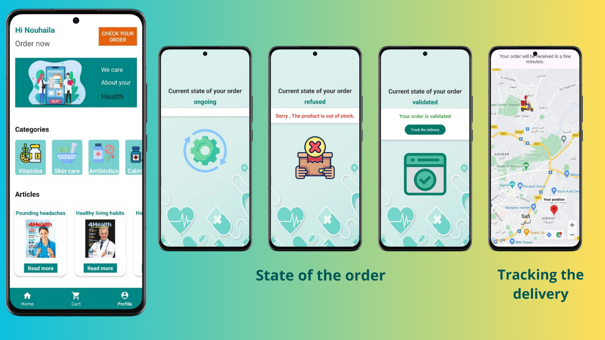
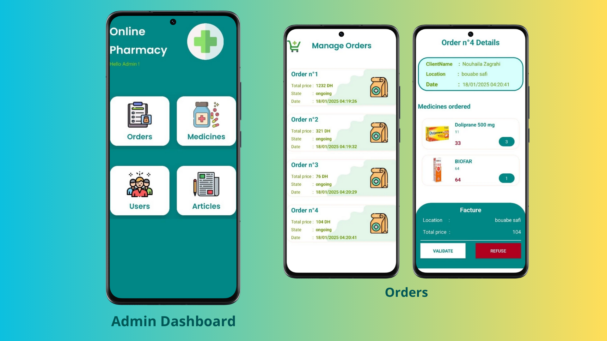
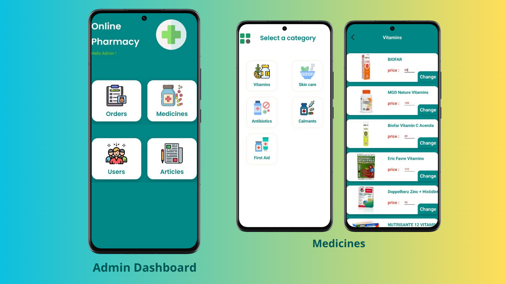
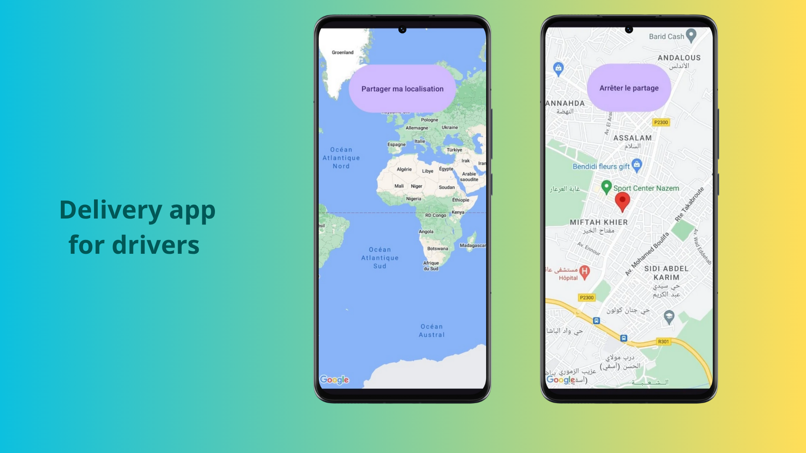

# PharmaLink 📱💊

## 🚀 Mobile Application for Easy Access to Medicines and Vitamins

PharmaLink is a native Android mobile app designed to simplify access to medicines and dietary supplements by offering a seamless user experience.

---

## 💡 Technologies Used

- **Android Studio** for native app development  
- **Kotlin & XML** for a smooth, responsive UI  
- **RecyclerView, DataBinding & Fragments** for optimized navigation  
- **SQLite** for efficient local data storage  
- **Firebase Realtime Database** for real-time delivery tracking 🚚📍  

---

## 🔹 Key Features

- Powerful search engine to quickly find medicines 🔍  
- Fast and simple ordering process  
- Health articles to stay updated on medical news 📰  
- Detailed medicine information including ingredients  
- Real-time delivery tracking for transparency and security 🚛📍  
- Personalized user profiles  
- Admin dashboard for managing requests, pricing, users, and articles ⚙️  

---

## 📸 Some Screenshots

  

  

  

  

  

  

---

## 🎯 Project Goal

PharmaLink aims to transform healthcare product access by combining speed, simplicity, and innovation to improve user satisfaction.

---

## 🙌 Contributions

Contributions and feedback are welcome to enhance the app!

---

Thank you for your interest in PharmaLink!
